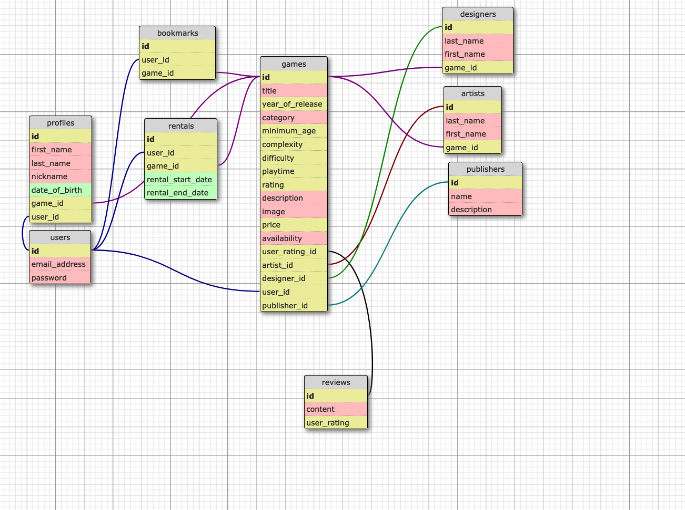

# README

# GameGrid

GameGrid is a Ruby on Rails application for managing and renting board games.
It focuses on the unsued board games sitting around in the basement of many families. Being able to offer unused boardgames and being able to rent them out, would benefit both parties.

## Table of Contents
- [Configuration](#configuration)
- [Usage](#usage)
- [Features](#features)
- [Contributing](#contributing)
- [Contact] (#contact)
- [License](#license)

## Configuration
* System dependencies

- Ruby version: ruby 3.1.2p20 (2022-04-12 revision 4491bb740a) [arm64-darwin22]
- Ruby (Check version with ruby -v)
- Rails version: Rails 7.0.6
- Rails (Check version with rails -v)
- PostgreSQL (If you're using PostgreSQL as your database)

Follow these steps to get the application up and running on your local machine:

1. Clone the repository: `git clone https://github.com/thorend/GameGrid.git`
2. Navigate to the project directory: `cd GameGrid`
3. Install dependencies: `bundle install`
4. Create the PostgreSQL database `rails db:create`
5. Set up the database: `rails db:setup`
6. Migrate the database and seed initial data: `rails db:migrate` `rails db:seed`
5. Start the server: `rails server`

## Usage

Once the server is running, open your web browser and go to `http://localhost:3000`.

- Sign up with your email and password to create an account.
- Browse the list of available board games.
- Rent a game by clicking on the "Rent" button.
- View your profile and rented games.

For more details, check out the [user guide] (not released yet)

## Features

- CRUD operations for items
- User authentication and authorization
- Payment method with "stripe"
- Interactive map with "mapbox-API"
- Responsive design for mobile and desktop
- Complex DB-managaement with one-to-one, one-to-many, many-to-many relationships 

## Contributing

Contributions are welcome! If you find a bug or want to suggest a new feature, please [open an issue](https://github.com/thorend/GameGrid/issues) or [submit a pull request](https://github.com/thorend/GameGrid/pulls).

To set up the development environment, follow the steps in the [development guide](tba)

A better way for Contributions would be to please follow these guidelines:
1. Fork the repository and create a new branch.
2. Make your changes and submit a pull request.
3. Ensure your code passes tests and adheres to the style guide.

## Contact

If you have questions or feedback, contact me at thorendepner@gmail.com.

## License

This project is licensed under the [MIT License](LICENSE.md).
